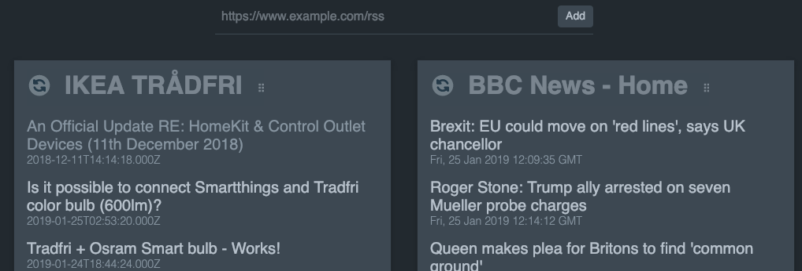

# rss-a-go-go

This is just a simple RSS feed reader written in JS (Vue).  The idea was to be able to open a new browser tab and it would show me some RSS feeds I was interested in without having to use any server-side code. All the feeds & settings are cached in your browser, so
multiple people could use the same install I guess.



## Installing on your own webserver

Just dump the contents of the `dist/` folder onto your server and visit the URL.

## Local project setup
```
yarn install
```

### Compiles and hot-reloads for development
```
yarn run serve
```

### Compiles and minifies for production
```
yarn run build
```

### Run your tests
```
yarn run test
```

### Lints and fixes files
```
yarn run lint
```

### Run your unit tests
```
yarn run test:unit
```

### Customize configuration
See [Configuration Reference](https://cli.vuejs.org/config/).
